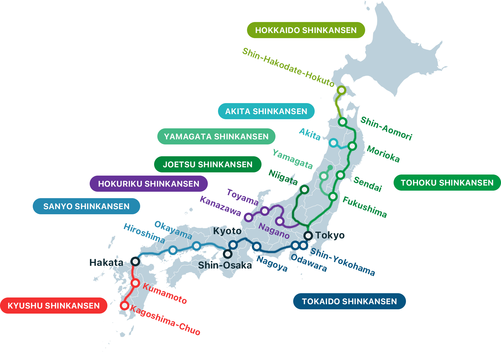

# Bullet train - Shinkansen guide

## Table of contents <!-- omit in toc -->

* [Main Shinkansen lines](#main-shinkansen-lines)
* [How to buy Shinkansen tickets](#how-to-buy-shinkansen-tickets)
* [SmartEX - Tokaido, Sanyo, and Kyushu Shinkansen lines](#smartex---tokaido-sanyo-and-kyushu-shinkansen-lines)
  * [Which train stations are covered by the Tokaido, Sanyo, and Kyushu Shinkansen lines?](#which-train-stations-are-covered-by-the-tokaido-sanyo-and-kyushu-shinkansen-lines)
  * [How to use SmartEX](#how-to-use-smartex)
  * [Confirm, change, and refund reservations](#confirm-change-and-refund-reservations)
  * [Important notes about SmartEX](#important-notes-about-smartex)
  * [Additional notes on using SmartEX](#additional-notes-on-using-smartex)
  * [Quick breakdown of Tokaido, Sanyo, and Kyushu Shinkansen lines](#quick-breakdown-of-tokaido-sanyo-and-kyushu-shinkansen-lines)
* [More information](#more-information)

## Main Shinkansen lines

Here is the map of the main Shinkansen lines in Japan:

**Hokkaido Shinkansen line**
* Shin-Hakodate-Hokuto

**Akita Shinkansen line**
* Akita

**Yamagata Shinkansen line**
* Yamagata

**Joetsu Shinkansen line**
* Niigata

**Hokuriku Shinkansen line**
* Toyama
* Kanazawa

**Tohoku Shinkansen line**
* Shin-Aomori
* Morioka
* Sendai
* Fukushima

**Tokaido Shinkansen line**
* Tokyo
* Shin-Yokohama
* Odawara
* Nagoya
* Kyoto
* Shin-Osaka

**Sanyo Shinkansen line**
* Okayama
* Hiroshima
* Hakata

**Kyushu Shinkansen line**
* Kumamoto
* Kagoshima-Chuo

## How to buy Shinkansen tickets

There are three websites that you can use to buy Shinkansen tickets:
* SmartEX - run by JR Central; fully supports English.
* Eki-net.com - run by JR East; partially supports English.
* Klook - a third-party website that sells Shinkansen tickets.

How do these three websites compare?

| Website                                                                  | Coverage                                       | Pros                                   | Cons                                                    | Who should use it?                                                                          |
| ------------------------------------------------------------------------ | ---------------------------------------------- | -------------------------------------- | ------------------------------------------------------- | ------------------------------------------------------------------------------------------ |
| [SmartEX](https://shinkansen2.jr-central.co.jp/RSV_P/smart_en_index.htm) | All Shinkansen stations south of Tokyo         | Fully supports English                 | Account setup required (30 minutes)                     | Anyone buying tickets for the Tokaido, Sanyo, and Kyushu Shinkansen lines                   |
| [Eki-net](https://www.eki-net.com/en/jreast-train-reservation/Top/Index) | All Shinkansen stations west and north of Tokyo | Allows seat reservations for JR Rail Pass users | Limited English support                         | JR Rail Pass users traveling on the Joetsu, Hokuriku, Tohoku, and Hokkaido lines            |
| [Klook](https://www.klook.com/japan-rail/shinkansen/)                    | All Shinkansen stations                         | Easiest to use                        | Additional fees; cannot specify exact seats | Casual travelers who want a hassle-free experience; modifying tickets could be difficult |

## SmartEX - Tokaido, Sanyo, and Kyushu Shinkansen lines

I recommend using SmartEX to buy Shinkansen tickets for the Tokaido, Sanyo, and Kyushu Shinkansen lines.
* SmartEX is run by JR Central and offers the best support both online and in-person at stations.
* SmartEX is available in English and is relatively easy to use.

### Which train stations are covered by the Tokaido, Sanyo, and Kyushu Shinkansen lines?

The following are the major Shinkansen stations covered by the Tokaido, Sanyo, and Kyushu Shinkansen lines:
1. Tokyo
2. Shinagawa
3. Shin-Yokohama (near Yokohama Station)
4. Nagoya
5. Kyoto
6. Shin-Osaka (near Osaka Station)
7. Shin-Kobe
8. Okayama
9. Hiroshima
10. Kokura
11. Hakata
12. Kumamoto
13. Kagoshima-Chuo (near Kagoshima Station)

### How to use SmartEX

1. [Create a SmartEX account](https://smart-ex.jp/en/beginner/entry/sp/)
2. [Make reservations](https://smart-ex.jp/en/reservation/reserve_smart/sp/)
3. [Purchase history/receipt](https://smart-ex.jp/en/reservation/reserve_smart/purchase_history/)
4. [Confirm reservations](https://smart-ex.jp/en/reservation/guide/referral/)

### Confirm, change, and refund reservations

How to change a reservation?
* Steps: [How to change](https://smart-ex.jp/en/reservation/guide/cancel/howto_change/)
* Details: [Change reservations](https://smart-ex.jp/en/reservation/change/)

How to cancel a reservation and get a refund?
* Steps: [How to refund](https://smart-ex.jp/en/reservation/guide/cancel/howto_change/)
* Details: [Refund reservations](https://smart-ex.jp/en/reservation/guide/cancel/)

### Important notes about SmartEX

* SmartEX only supports tickets for the Tokaido, Sanyo, and Kyushu Shinkansen lines.
  * Use either Eki-net or Klook for other Shinkansen lines.
* You cannot use SmartEX with the Japan Rail Pass or other passes.
* When you click `Purchase`, your credit card will be charged.
  * After this point, there is a cancellation fee.
  * Changing the reservation is free.
* Luggage - you must reserve a seat with an oversized baggage area if you have luggage larger than carry-on size. [Details](https://smart-ex.jp/en/entraining/oversized-baggage/)

### Additional notes on using SmartEX

* All dates and times are in Japan Standard Time (JST).
* All prices are in Japanese Yen (JPY).
* If you want a paper ticket, you will need the `pickup code` and account login credentials.
* If your credit card does not support [3-D Secure Authentication](https://smart-ex.jp/en/reservation/reserve_smart/3dsecure/), you will need to enter a security code each time you buy a ticket.
* You cannot mix train classes (regular vs. Green) on the same ticket.
  * Example: You need two tickets if you want to use the Green car (first-class car) on the first train, followed by a reserved car (ordinary car) on the second train.
* You cannot mix train types (express vs. local) on the same ticket.
  * Example: You need two tickets if you want to use the Nozomi on the first train, followed by a Hikari on the second train.

### Quick breakdown of Tokaido, Sanyo, and Kyushu Shinkansen lines

* Tokaido Shinkansen (Tokyo to Shin-Osaka)
* Sanyo Shinkansen (Shin-Osaka to Hakata)
* Kyushu Shinkansen (Hakata to Kagoshima-Chuo)

## More information

* [Shinkansen (Japanese Bullet Train)](https://www.japan-guide.com/e/e2018.html#ticket)
* [Shinkansen travel tips | Japan Experience - Japan Rail Pass](https://www.japan-experience.com/plan-your-trip/travel-by-train/shinkansen)
* SmartEX - [About Tokaido Sanyo Kyushu Shinkansen](https://smart-ex.jp/en/reservation/equipment/)
* [Using Ekinet to make online seat reservations with the Japan Rail Pass.](https://www.jrpass.com/blog/using-ekinet-to-make-online-seat-reservations-with-the-japan-rail-pass)
