# {{$frontmatter.title}}

{{$frontmatter.description}}

Platto Kodama (`ぷらっとこだま`) Regular Car; Reserved seat plan

[[toc]]

## Overview

### Travel time between Tokyo and Kyoto

| Name   | JP     | Time       | Note                                         |
| ------ | ------ | ---------- | -------------------------------------------- |
| Nozmoi | のぞみ | 2.25 hrs   | Fastest, Cannot use JR Pass                  |
| Hikari | ひかり | 2.67 hours | Can use JR Pass                              |
| Kodama | こだま | 3.62 hours | Slowest (1.37 hours slower), Can use JR Pass |

## Naming

* Japanese: `ぷらっとこだま普通車指定席プラン`
* Google Translate: Plattokodama Regular Car Reserved Seat Plan
* English: Platt Kodama

## Pricing

* Platto Kodama + Ordinary car plan -> 10,600 yen
* Platto Kodama + Green car plan -> 12,100 yen
* Comparison (Regular Prices):
  * **Nozomi** Ordinary car; reserved seat -> 14,170 yen (+3,670 yen)
  * **Hikari** or **Kodama** Ordinary car; reserved seat -> 13,850 yen (+3,350 yen)

## Restrictions

* Platto Kodama tickets MUST be purchased the day BEFORE the travel date.
  * It cannot be bought on the day of travel
* Fixed trip plan - you cannot take any other trains.
* Seat assigned - you cannot use any other seat or change the seat.
* No stopover allowed - your ticket expires once you get off the train.
* A handling charge is charged when issuing a refund

## Is it worth it?

| Trip                 | Savings   | Added Travel Time |
| -------------------- | --------- | ----------------- |
| Tokyo ↔ Shin-Osaka  | 4,020 yen | +1.5 hrs          |
| Tokyo ↔ Kyoto       | 3,670 yen | +1.5 hrs          |
| Tokyo ↔ Nagoya      | 2,800 yen | +1 hr 10 mins     |
| Nagoya ↔ Shin-Osaka | 2,180 yen | +21 mins          |
| Nagoya ↔ Kyoto      | 1,510 yen | +21 mins          |

## Details

Japanese

* Homepage: [ぷらっとこだま - JR東海ツアーズ](https://www.jrtours.co.jp/service/ad/kodama/?utm_source=forit&utm_medium=affiliate&utm_campaign=banner&fil=%7B%22pr%22%3A%7B%22y13754Z%22%3A%7B%22clk%22%3A%223c0a4157b9ad93669fb452342c5f6875%22%2C%22ym%22%3A%22202307%22%7D%7D%7D)
* Where and How to Pick up the tickets: [受取箇所 - JR乗車票の受取箇所・受取方法 - 新幹線のお得なツアーはJR東海ツアーズ](https://www.jrtours.co.jp/receive/ticket/p1.asp)

English

* Homepage: <https://www.jrtours.co.jp/kodama/english/>

## Booking methods

### In-person booking

Go to a JR Tokai Tours branch office and book the ticket in person.

* [Tokyo station branch location](#pick-up-at-tokyo-station)
* [Shinagawa station branch location](#pick-up-at-shinagawa-station)
* [Shin-Yokohama station branch location](#pick-up-at-shin-yokohama-station)
* [Nagoya station branch location](#pick-up-at-nagoya-station)
* [Kyoto station branch location](#pick-up-at-kyoto-station)
* [Shin-Osaka station branch location](#pick-up-at-shin-osaka-station)

### Online booking

* Only via the Japanese website 😭
  * <https://www.jrtours.co.jp/kodama> ⚠️
  * ⚠️ Google Translate will break the website

⚠️ **Warning** for online booking ⚠️

* Their website is terrible and can run into bugs!
* Some credit cards are denied without reason given.
* Reservations on this site are ONLY available from 5:30 to 23:30
  * Apparently, their servers need to sleep...

⚡ **Tips** for online booking

* Create an account first (it is buggy )
  * It is called My Page (`マイページ`) account
* Reserve tickets well **ahead of 23:30**
* Prepare multiple credit card options

#### Search query

| Japanese   | English          | Example Values                            |
| ---------- | ---------------- | ----------------------------------------- |
| `乗車日`   | Boarding date    | `2020/01/01`                              |
| `乗車駅`   | Boarding station | `東京` (Tokyo)                            |
| `降車駅`   | Arrival station  | `京都` (Kyoto)                            |
| `出発時刻` | Boarding time    | Select the earliest desired boarding time |

#### Online booking steps

1. `商品選択` - Product selection
1. `選択内容確認` - Confirm your selection
1. `取引条件確認` - Confirm transaction conditions
1. `申込情報入力` - Enter application information
1. `申込情報確認` - Confirm application information
1. `申込完了` - Application completed

<!-- * ⚡️ Note: For ¥1,700 extra, you can reduce the travel time by 1.37 hours by selecting -->

## Vouchers you will get

With `Platt Kodama`, you will get the following vouchers/documents the following:

* Platt Itinerary - _i.e., receipt_
* Kodama Coupon - _Train ticket for the Kodama Express Shinkansen_
* Platt Drink Voucher

What is the `Kodama Coupon`?

* Use Kodama Coupon as a ticket for the Kodama Express train.
  * You do not need to exchange the coupon for a ticket.
* Only use ticket gates for JR Tokai's SHINKANSEN train!
  * Show the Kodama Coupon at the gates.
  * ⚠️ Do not use automatic gates.

## Platt free drink

Get a free drink at shops with the following conditions:

* In the Tokaido Shinkansen Stations (Tokyo ~ Shin-Osaka Stations)
* Shops with this sticker 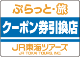
* ⚠️ The voucher cannot be exchanged on Kodama Express as there is no wagon service.

## Pick up the Platt Kodama tickets

Two Steps:

1. **Prep** - Get your **Platt Kodama ticket's pickup QR Code** and **confirmation 6-digit code** ready!
1. **Pickup** - Scan the QR Code and input the confirmation code to get your tickets from the Ticket Machine

### Prep - getting the ticket pickup QR code and confirmation code

1. Navigate to the JR Tokai Tours's Reservation Confirmation Page (`予約内容確認`): <https://ec.jrtours.co.jp/ec/member/InquirySelect>
1. Log in to your My Page (`マイページ`) account
1. Click the `一覧` (List) or `一覧を表示する` (Display list) button
1. Click the `詳細` (Details) button
1. Navigate to the `選択ツアー詳細` (Select tour details) column
1. Click the `JR乗車票` `受取コード` `確認コード表示` (JR boarding pass receipt code/confirmation code display) button
1. A Platt Kodama ticket's pickup QR Code and confirmation 6-digit code will be displayed
1. {Optional} Repeat the process to display the return trip's Platt Kodama ticket pickup QR Code

| Step  | ScreenShot                                                                      |
| ----- | ------------------------------------------------------------------------------- |
| 3 ~ 4 | 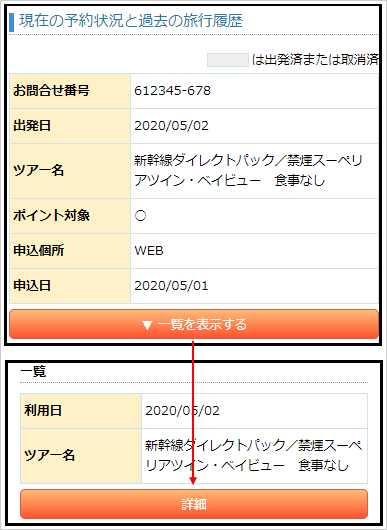 |
| 5     |  |

### Pickup - using the ticket machine

⚠️ Navigate to the **Correct** Ticket Machine

| ✅ Correct Ticket Machines                                                                 | ❌ Incorrect Ticket Machines                                                                   |
| ------------------------------------------------------------------------------------------ | ---------------------------------------------------------------------------------------------- |
| 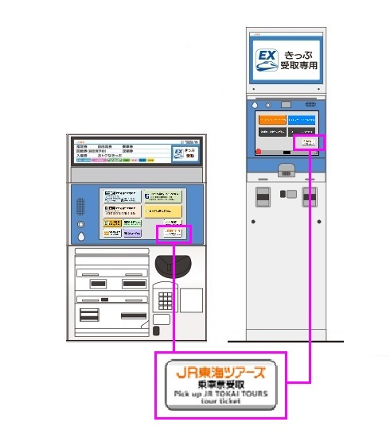 | 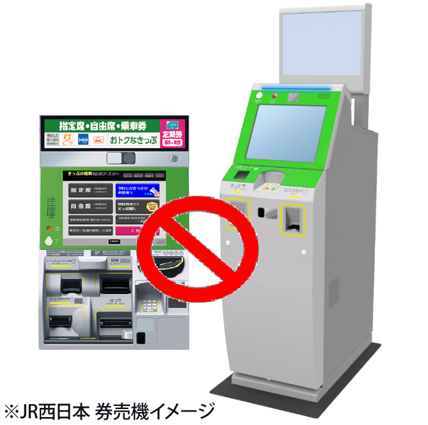 |

| Steps | Screenshots                                                       | Description                                                                                                                              |
| ----- | ----------------------------------------------------------------- | ---------------------------------------------------------------------------------------------------------------------------------------- |
| 1     | 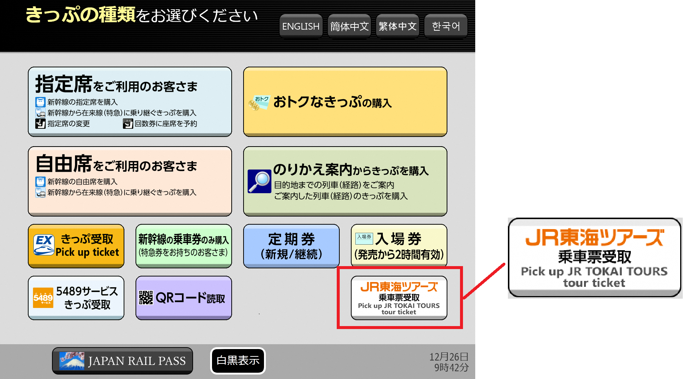 | Please press the "Pick up JR TOKAI TOURS tour ticket" button                                                                             |
| 2     | 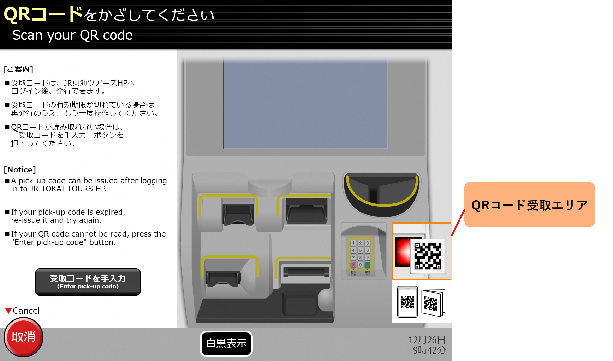 | Scan the Platt Kodama ticket's pickup QR Code                                                                                            |
| 3     | 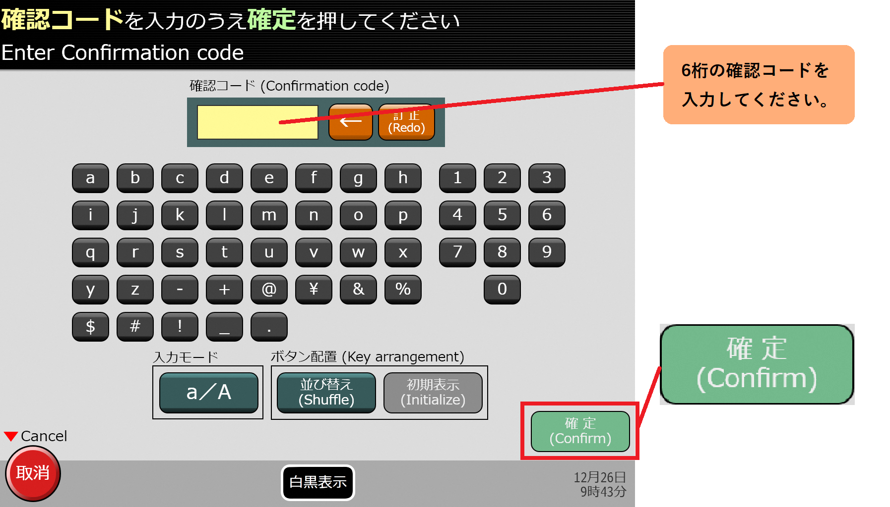 | Input the confirmation 6-digit code and press the "Confirm" button                                                                       |
| 4     | 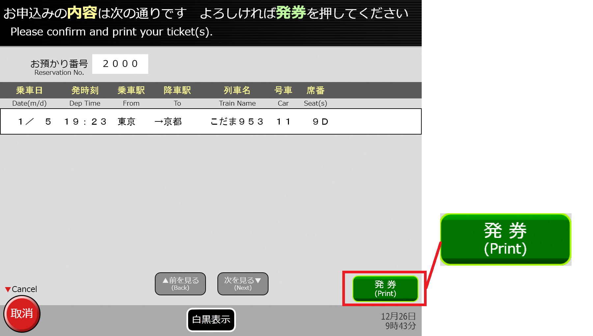 | Confirm the ticket details and press the "Print" button                                                                                  |
| 5     | 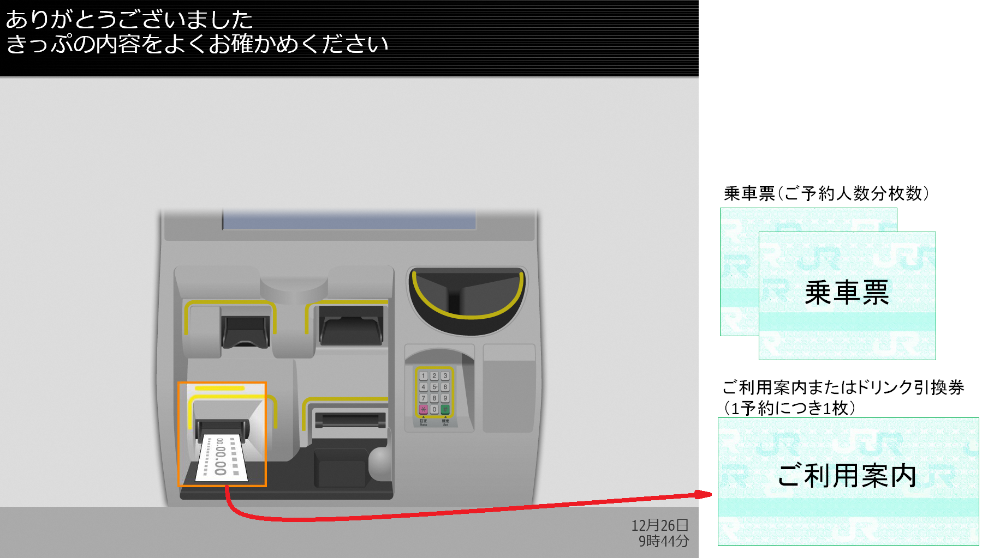 | Please take all the vouchers/documents: Platt Itinerary (1x), Kodama Coupon (number of passengers), Drink Voucher (number of passengers) |

### Pickup locations

(As of September 2020)

* Tokyo Station
* Shinagawa Station
* Shin-Yokohama Station
* Shizuoka Station
* Hamamatsu Station
* Nagoya Station
* Kyoto Station
* Shin-Osaka Station

⚠️ Tickets cannot be picked up by Ticket Machines inside the JR East, JR West, or JR Kyushu stations.

### Pick Up at Tokyo Station

Branch Location:

* Next to the ticket gate at the South Yaesu Exit of Tokyo Station
* [Google map](https://goo.gl/maps/oStEkxBpDH2ryWYw7)
* 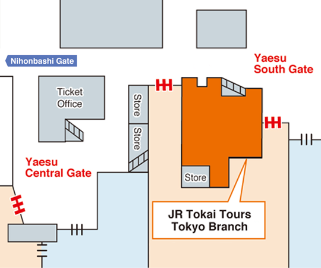

Hours:

* Mon - Fri: 10:00-18:00
* Sat/Sun/Holidays: 10:00-18:00

### Pick Up at Shinagawa station

Branch Location:

* Next to the Shinkansen South exit in JR Shinagawa Station
* [Google map](https://goo.gl/maps/Xa9w8Q9tdGv)
* 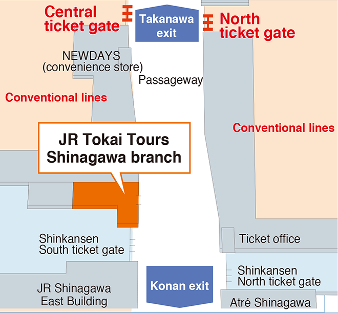

Hours:

* Mon - Fri: 11:00-18:00
* Sat/Sun/Holidays: 11:00-18:00

### Pick Up at Shin-Yokohama station

Branch Location:

* Next to Shinkansen West exit in JR Shin-Yokohama Sta.
* [Google map](https://goo.gl/maps/eVaWbrJ9SG22)
* 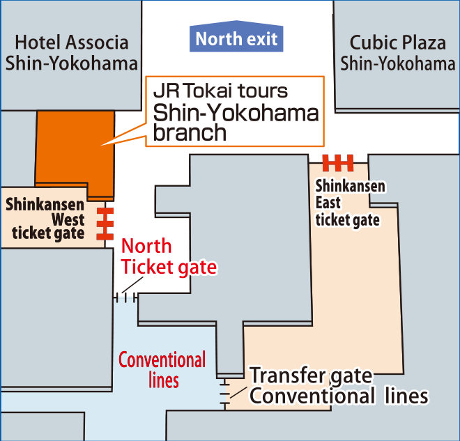

Hours:

* Mon - Fri: 10:00-17:00
* Sat/Sun/Holidays: 10:00-17:00

### Pick Up at Nagoya station

Branch Location:

* Central concourse in JR Nagoya Sta.
* [Google map](https://goo.gl/maps/ZHPPz3jpf9U2)
* 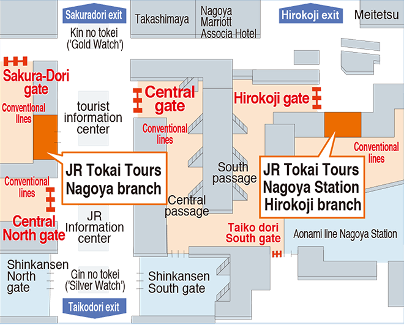

Hours:

* Mon - Fri: 10:00-18:00
* Sat/Sun/Holidays: 10:00-18:00

### Pick Up at Kyoto Station

#### 1st Floor Kyoto Branch

Branch Location:

* 1st Floor of JR Kyoto Station - Hachijo exit
* [Google map](https://goo.gl/maps/cspqtD921dn)
* 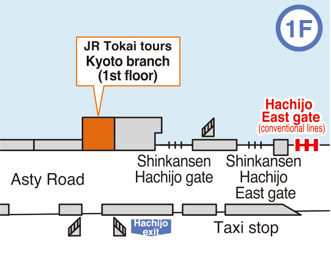

Hours:

* Mon - Fri: 10:30-18:00
* Sat/Sun/Holidays: 10:30-18:00

#### 2nd Floor Kyoto Branch

Branch Location:

* 2nd Floor of JR Kyoto Station - Shinkansen Central exit
* [Google map](https://goo.gl/maps/XyhTsHkCVC92)
* 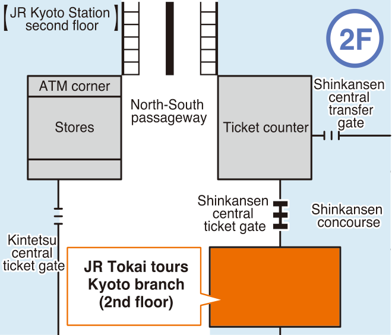

Hours:

* Mon - Fri: 9:30-17:30
* Sat/Sun/Holidays: 9:30-17:30

### Pick Up at Shin-Osaka Station

Branch Location:

* Next to Shinkansen central exit
* 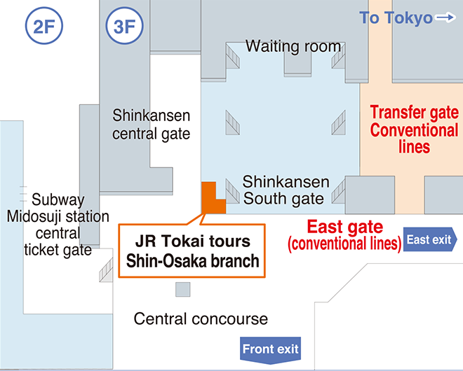
* [Google map](https://goo.gl/maps/HmWknzTUXSs)

Hours:

* Mon - Fri: 10:00-17:30
* Sat/Sun/Holidays: 10:00-17:30

## Call JR Tokai Tours Support

* JR Tokai Tours / `JR東海ツアーズ`
* Platto Travel Support / `ぷらっと旅・コールセンター`
* Platto Kodama "Online Reservation" Tour Desk / `ぷらっとこだま"ネット予約"ツアーデスク`
* Business days: Open all year round (excluding year-end and New Year holidays)
* Business hours: 10:00-18:00
* Phone number: 03-6854-4160

## Sources

* [東京・京都のお得な利用法 - 新幹線旅行研究所](https://shinkansen.tabiris.com/tokyo_kyoto.html)
* [Platt Kodama, one-way deal among Tokyo, Nagoya, Kyoto, and Shin-Osaka by the Shinkansen - JPRail.com](https://jprail.com/travel-informations/other-rail-passes/rail-pass-for-residents/platt-kodama-one-way-deal-among-tokyo-nagoya-kyoto-and-shin-osaka-by-shinkansen.html#toc1)

## ⚠️ JR Central's servers are down from 23:30 ~ 5:00 JST ⚠️

You cannot book tickets during this time.

## Takaido Shinkansen Line - JR Central

* JR Central operates the Tokaido Shinkansen Line, which connects Tokyo and Shin-Osaka.
* The line is served by 3 types of trains: Nozomi, Hikari, and Kodama
  * Nozomi is the fastest, express train. Nozomi is not covered by the Japan Rail Pass.
  * Hikari is the second fastest. Hikari is covered by the Japan Rail Pass.
  * Kodama is the slowest, stopping at every station. Kodama is covered by the Japan Rail Pass.

### Stations on the Tokaido Shinkansen Line

| Station       | Nozomi | Hikari | Kodama |
| ------------- | ------ | ------ | ------ |
| TOKYO         | ⬤      | ⬤      | ⬤      |
| SHINAGAWA     | ⬤      | ⬤      | ⬤      |
| SHIN-YOKOHAMA | ⬤      | ⬤      | ⬤      |
| ODAWARA       |        | ▲      | ⬤      |
| ATAMI         |        | ▲      | ⬤      |
| MISHIMA       |        | ▲      | ⬤      |
| SHIN-FUJI     |        | ▲      | ⬤      |
| SHIZUOKA      |        | ⬤      | ⬤      |
| KAKEGAWA      |        | ▲      | ⬤      |
| HAMAMATSU     |        | ▲      | ⬤      |
| TOYOHASHI     |        | ▲      | ⬤      |
| MIKAWA-ANJO   |        | ▲      | ⬤      |
| NAGOYA        | ⬤      | ⬤      | ⬤      |
| GIFU-HASHIMA  |        | ▲      | ⬤      |
| MAIBARA       |        | ▲      | ⬤      |
| KYOTO         | ⬤      | ⬤      | ⬤      |
| SHIN-OSAKA    | ⬤      | ⬤      | ⬤      |

**Legend**

* ⬤ = Stop
* ▲ = Some trains stop
* (Blank) = No stop
