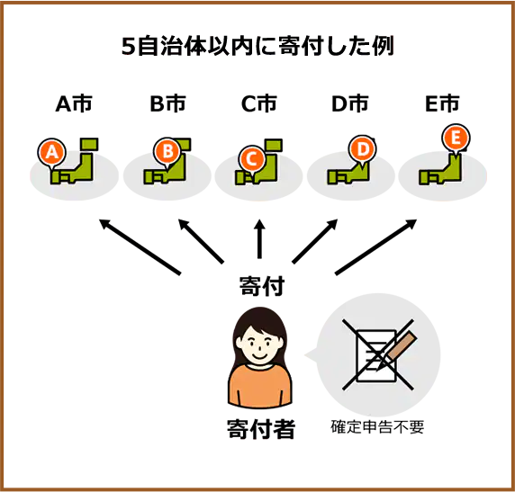
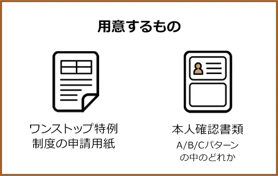

# ふるさと納税ワンストップ特例制度・特例申請書-入門ガイド

* 監修: セブンセンス税理士法人
* 公認会計士・税理士: 大野 修平
* ふるさと納税サイト: [さとふる](https://www.satofull.jp/miniapp/pages/static-onestop/static-onestop.html)

## 目次 <!-- omit in toc -->

* [ワンストップ特例制度とは？](#ワンストップ特例制度とは)
  * [ワンストップ特例制度を利用するメリット](#ワンストップ特例制度を利用するメリット)
  * [ワンストップ特例制度の申請条件](#ワンストップ特例制度の申請条件)
  * [ワンストップ特例制度のスケジュール](#ワンストップ特例制度のスケジュール)
* [ワンストップ特例制度の手続きの流れ](#ワンストップ特例制度の手続きの流れ)
  * [申請に必要なものを揃える](#申請に必要なものを揃える)
    * [ワンストップ特例制度の申請用紙の入手方法](#ワンストップ特例制度の申請用紙の入手方法)
    * [本人確認書類](#本人確認書類)
  * [申請書類を記入する](#申請書類を記入する)
  * [提出期限までに各自治体に書類を郵送する](#提出期限までに各自治体に書類を郵送する)
* [ワンストップ特例制度と確定申告の違い](#ワンストップ特例制度と確定申告の違い)
  * [控除対象と控除額](#控除対象と控除額)
    * [控除額](#控除額)
  * [寄付できる自治体数](#寄付できる自治体数)
  * [申請期限](#申請期限)
* [ワンストップ特例制度の注意事項](#ワンストップ特例制度の注意事項)
  * [確定申告を行うとワンストップ特例制度による申請は無効](#確定申告を行うとワンストップ特例制度による申請は無効)
  * [「寄附金税額控除に係る申告特例申請書 (ワンストップ特例申請書) 」の送付締切に注意](#寄附金税額控除に係る申告特例申請書-ワンストップ特例申請書-の送付締切に注意)
  * [寄付の回数に応じた申請書類の用意が必要](#寄付の回数に応じた申請書類の用意が必要)
  * [控除対象は住民税のみ](#控除対象は住民税のみ)
  * [引っ越しなどで申込内容が変わったら申請事項変更届出書が必要](#引っ越しなどで申込内容が変わったら申請事項変更届出書が必要)
* [ワンストップ特例制度のよくあるご質問](#ワンストップ特例制度のよくあるご質問)

## ワンストップ特例制度とは？

ワンストップ特例制度とは, 確定申告を行わなくても, ふるさと納税の寄付金控除を受けられる便利な仕組みです。  
ふるさと納税先の自治体が1年間で5自治体以内であれば, この制度を活用できます。  
通常, ふるさと納税で寄付金控除を受けたい場合には確定申告が必要ですが, 会社勤めの方など年末調整を受けている方は, ワンストップ特例制度を利用することで確定申告をしなくても寄付金控除を受けることが可能となります。  
ワンストップ特例制度を利用するには, 寄付先の自治体に申請書等の必要書類を申請期間内に提出する必要があります。ワンストップ特例制度が適用されると, 所得税からの控除は発生せず, 翌年の6月以降に支払う住民税から自動的に控除されます。

| 5自治体以内に寄付した例                      | 税金控除の仕組み                                                                                                 | 確定申告を行わずに簡単な申請で個人住民税の控除を受けられるようになります。                                                                                                                           |
| -------------------------------------------- | ---------------------------------------------------------------------------------------------------------------- | ---------------------------------------------------------------------------------------------------------------------------------------------------------------------------------------------------- |
|  |  |   [寄付者]   →   寄付 + ワンストップ特例申請書の提出   →   [寄付先の自治体]   →   連絡   →   [住んでいる自治体]   →   翌年度分の住民税から控除   →   [寄付者] |

### ワンストップ特例制度を利用するメリット

1. **確定申告を行わなくても寄付金控除が受けられる**  
   会社勤めなどで年末調整を受けている場合, 確定申告をせずに寄付金控除を受けられます。

2. **手続きが簡単**  
   自治体ごとに申請書等の必要書類を郵送するだけで手続きが完了します。

### ワンストップ特例制度の申請条件

ワンストップ特例制度は, 以下の条件に当てはまる場合に利用できます。

1. もともと確定申告や住民税申告をする必要のない給与所得者等であること
2. ふるさと納税以外に確定申告または住民税の申告を行う必要がない方
3. 年間寄付先が5自治体以内であること

簡単に言えば, ふるさと納税以外に申告するものがない場合に限り, 利用できる制度ということになります。会社に勤めている一般的な方であれば, 問題なく利用可能です。  
※6回以上ふるさと納税を行っても, 5自治体以内であればワンストップ特例制度をご活用いただけます。

* ※2022年8月17日現在の制度に基づいており, 今後の制度改正等により変更になることがあります。
* ※募金団体 (日本赤十字社や中央共同募金会など) を通じた義援金については, 「ふるさと納税ワンストップ特例制度」は利用できません。 (ふるさと納税としての控除を受けるためには, 確定申告が必要です)
* ※確定申告をする方はワンストップ特例申請を利用することができません。

**ワンストップ特例制度の注意事項**  
* 控除対象は住民税のみ  
  * ※所得税控除の上限に抵触しない場合, ワンストップ特例制度と確定申告で控除額合計として原則的には差はありません。  
* 寄付を行った回数分, ワンストップ特例申請書の提出が必要  
* 「寄附金税額控除に係る申告特例申請書 (ワンストップ特例申請書) 」の送付締切に注意  
* 申込内容が変わった場合は, 期限までに申請事項変更届出書の提出が必要  
* 確定申告を行うとワンストップ特例制度による申請は無効

### ワンストップ特例制度のスケジュール

ワンストップ特例制度の申請期限は, 寄付をした翌年の1月10日 (必着) です。  
今年の1月1日 ~ 12月31日に寄付をした分は, 寄付ごとに申請書と必要書類を用意し, 申請期限までに自治体へ送付する必要があります。  
提出が間に合わなかった場合は, 確定申告をする必要がありますのでご注意ください。

## ワンストップ特例制度の手続きの流れ

  

### 申請に必要なものを揃える

まずは, ワンストップ特例制度を利用するために以下の書類を用意します。

ワンストップ特例制度の申請は, ふるさと納税を行った先の自治体へ, 必要事項を記入したワンストップ特例申請書 (寄附金税額控除に係る申告特例申請書) を送付することが必須です。

ワンストップ特例申請書は, 各自治体から郵送されるケースも多いですが, 自治体や総務省のホームページでも入手できます。

#### ワンストップ特例制度の申請用紙の入手方法

ワンストップ特例制度の申請用紙は以下の方法で入手できます。

ご自身で申請用紙を用意される場合は, 無記入の申請用紙をダウンロードし, 印刷した用紙に必要事項を記入し提出することも可能です。

#### 本人確認書類

申請のためには, マイナンバーおよび本人を確認できる書類の写しを同封する必要があります。

下記3パターンのうち, いずれかの方法で書類をご用意ください。

1. **Aパターン**
   * マイナンバーカード (写し※両面)

2. **Bパターン**
   * 通知カード (写し) もしくは住民票 (写し: 個人番号入り)
   * 運転免許証 (写し) もしくはパスポート (写し)

3. **Cパターン**
   * 通知カード (写し) もしくは住民票 (写し: 個人番号入り)
   * 健康保険証および年金手帳など, 提出先自治体が認める公的書類2点以上の写し

> ※健康保険証に記載されている保険証番号, 被保険者記号・番号, QRコード (※記載のある場合) は, 情報が見えないよう付箋などで該当箇所を隠してからコピーしてください。  

  

### 申請書類を記入する

ワンストップ特例制度の申請用紙 (寄附金税額控除に係る申告特例申請書) に必要事項を記入します。  
必要事項の書き方は【見本】よりご確認ください。

【見本】  

  

### 提出期限までに各自治体に書類を郵送する

STEP1, STEP2で用意した申請書類を, ふるさと納税を行った先の自治体に郵送してください。  
申請期限は, ふるさと納税を行った翌年の1月10日 (必着) です。

この期限までに, 不備のない状態で自治体へ到着するようにしてください。

**提出前にこちらでチェック！**

* **Aパターン** マイナンバーカード (写し※両面)
* **Bパターン** 通知カード (写し) or 住民票 (写し: 個人番号入り) + 運転免許証 (写し) or パスポート (写し)
* **Cパターン** 通知カード (写し) or 住民票 (写し: 個人番号入り) + 健康保険証, 年金手帳, 提出自治体が認める公的書類のうちいずれか2点の写し

※同一自治体へ複数お申し込みをされた方は, お申し込み件数分の申請書と本人確認書類を送付する必要があります。

---

## ワンストップ特例制度と確定申告の違い

ふるさと納税での控除を受けるにはワンストップ特例制度以外にも, 一般的な確定申告を行う方法があります。  
2つの方法にはどういった違いがあるのでしょうか？代表的な相違点についてお伝えします。

### 控除対象と控除額

|          | 確定申告をする場合                                                                                            | ワンストップ特例制度を利用する場合                                                   |
| -------- | ------------------------------------------------------------------------------------------------------------- | ------------------------------------------------------------------------------------ |
| 控除対象 | 所得税と住民税                                                                                                | 住民税のみ (所得税の控除分も住民税から控除)                                          |
| 控除例   | 10,000円のふるさと納税を行った場合 自己負担分: 2,000円 所得額から控除: 800円 住民税から控除: 7,200円 | 10,000円のふるさと納税を行った場合 自己負担分: 2,000円 住民税から控除: 8,000円 |

確定申告とワンストップ特例制度は, 控除される税金が異なります。確定申告では所得税と住民税がそれぞれ控除対象になりますが, ワンストップ特例制度で控除対象になるのは住民税のみです。

所得税の控除分もまとめて住民税から控除されるため, ワンストップ特例制度を利用しても, 基本的に控除上限に達しない限り, 控除額に差はありません。

#### 控除額

ワンストップ特例制度と確定申告のどちらを行ったとしても, 基本的には控除額に差はありません。  
ただし, 住宅ローン控除を受けている場合は例外です。住宅ローンの控除対象は所得税であるため, ふるさと納税を確定申告で申告した場合, 控除対象分が減ってしまう可能性があります。  
一方, ワンストップ特例制度を利用した場合は住民税のみが控除対象で, 住宅ローン控除を利用していたとしても合計の控除額に影響はありません。

---

### 寄付できる自治体数

| 確定申告をする場合 | ワンストップ特例制度を利用する場合 |
| ------------------ | ---------------------------------- |
| 6自治体以上でもOK  | 5自治体まで                        |

ワンストップ特例制度を利用できるのは, ふるさと納税の寄付先が5自治体以下の場合です。同じ自治体であれば複数回ふるさと納税を行っても自治体は1つとしてカウントされます。  
ただし, 同じ自治体に複数回寄付した場合も, ふるさと納税の寄付をするたびにワンストップ特例制度の申請が必要です。 (1件の寄付につきワンストップ特例申請書が1枚必要です)

このように, 多くの自治体に寄付する方向けの確定申告, 寄付自治体数がそれほど多くない方向けのワンストップ特例制度といった使い分けができます。

---

### 申請期限

| 確定申告をする場合      | ワンストップ特例制度を利用する場合 |
| ----------------------- | ---------------------------------- |
| 翌年の2月16日 ~ 3月15日 | 翌年の1月10日                      |

ワンストップ特例制度の申し込み期限は, ふるさと納税を行った翌年の1月10日まで (必着) です。  
一方, 確定申告は毎年2月16日 ~ 3月15日の期間で行われます。ワンストップ特例制度を利用する場合は確定申告よりもスケジュールに余裕がないため, 年内から準備しておくことをおすすめします。

---

## ワンストップ特例制度の注意事項

ワンストップ特例制度の申請に際しては, いくつか注意していただきたいポイントがあります。

### 確定申告を行うとワンストップ特例制度による申請は無効

確定申告を行った場合, たとえワンストップ特例制度で申請していたとしても, ワンストップ特例制度を利用することはできません。

注意が必要なケースが, 1年で一定額以上の医療費が発生し, 医療費控除申請を行う場合です。医療費控除の条件を満たしている場合, 確定申告で医療費控除を受けられますが, 同時にワンストップ特例制度による住民税控除が受けられなくなるため, 確定申告で寄付金控除を申告する必要があります。

### 「寄附金税額控除に係る申告特例申請書 (ワンストップ特例申請書) 」の送付締切に注意

「寄附金税額控除に係る申告特例申請書」は, 翌年の1月10日までに各自治体に到着するよう送付しなければなりません。締切に間に合わない場合も確定申告で申し込めますが, 早めの準備が推奨されます。

### 寄付の回数に応じた申請書類の用意が必要

ワンストップ特例制度の上限自治体数は5自治体です。同じ自治体であれば複数回ふるさと納税を行っても1としてカウントされますが, 寄付の回数に応じて申請が必要です。 (1件の寄付につき1枚の申請書が必要です)

### 控除対象は住民税のみ

ワンストップ特例制度を申し込んだ場合, 控除対象となるのは住民税のみです。実質的な控除額に差はありませんが, 確定申告の場合のような所得税の還付はなく, 住民税からの控除という形で還元されます。

### 引っ越しなどで申込内容が変わったら申請事項変更届出書が必要

申請書を提出済みで, 寄付をした翌年1月1日までの間に住所など申請内容 (電話番号を除く) に変更があった場合は, 「申請事項変更届出書」を提出してください。

---

## ワンストップ特例制度のよくあるご質問

* **申請はいつからできますか？**  
  ワンストップ特例制度の申請は, 納付日より行っていただけます。ワンストップ特例制度の申請に「寄付金控除に関する証明書」や「寄付金受領証明書」は必要ありません。

* **申請書類に不備があった場合や, 申請期日に間に合わなかった場合はどうなりますか？**  
  翌年の1月10日 (必着) に間に合わなかったり申請書類に不備があった場合, ワンストップ特例制度の申請は受理されません。その場合は確定申告を行ってください。

* **ワンストップ特例に必要な申請書はいつ頃届きますか？**  
  自治体によっては, ワンストップ特例申請書の郵送をしていない場合もあります。その場合, 申告特例申請書をダウンロードできますので, ご利用ください。

* **申請後に確定申告を行いたい場合はどうすればよいですか？**  
  ワンストップ特例制度の申請書の送付後でも確定申告は可能です。両方の申請を行った場合, 自動的に確定申告が優先されます。
