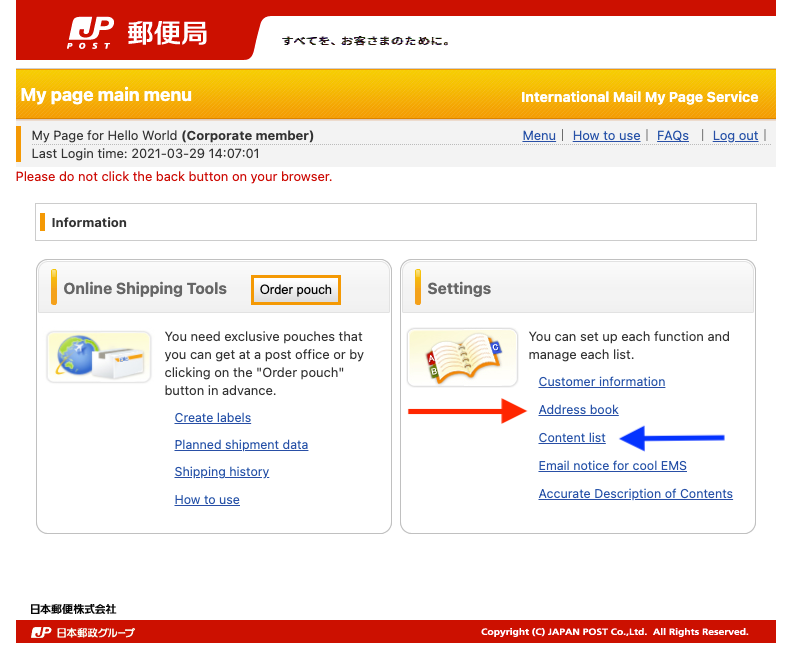
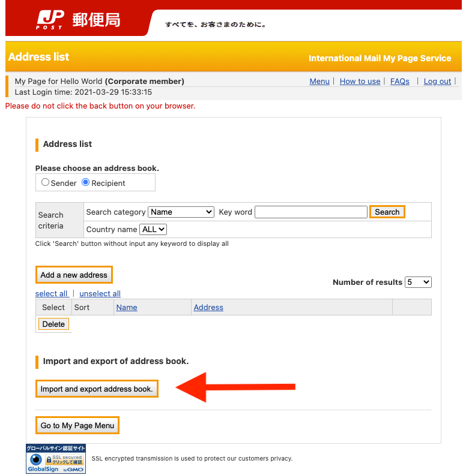
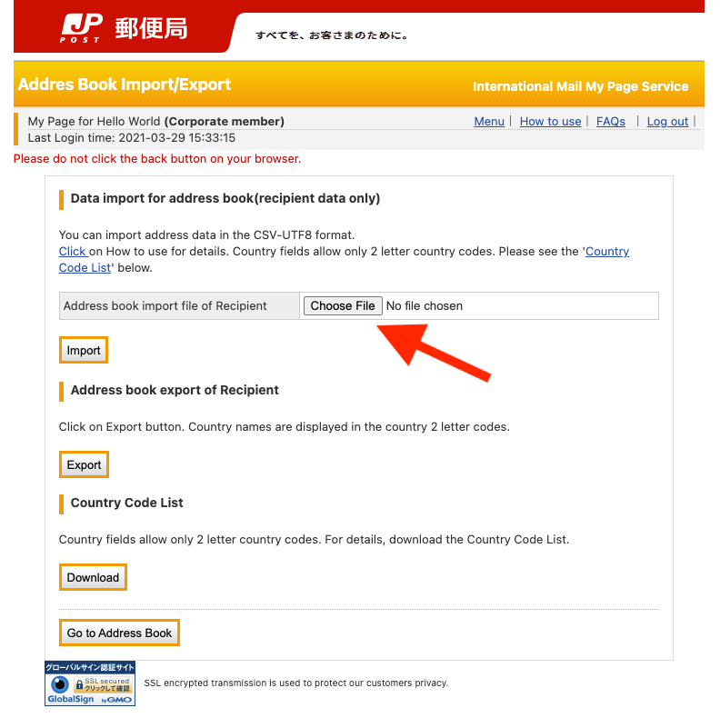

# {{$frontmatter.title}}

{{$frontmatter.description}}

[[toc]]


## Japan Post - international mail

* International Mail labels must be done with [Electronic Advance Data (EAD)](https://www.post.japanpost.jp/int/ead/index_en.html)
* JAPAN Post does not accept postal items addressed to the United States with a handwritten label.
* use the "[International Mail My Page Service](https://www.post.japanpost.jp/intmypage/whatsmypage_en.html)" to send EMS, international parcels and small packets, etc.


## International Mail My Page Service

* [Login - International Mail My Page Service](https://www.int-mypage.post.japanpost.jp/mypage/M010000.do?request_locale=en)
* [Online Shipping Tool - JAPAN Post](https://www.post.japanpost.jp/intmypage/online_en.html)
* Phone Support:
  * Japanese: 0120-5931-55
  * English ： 0570-046-111
    * English was faster
  * Service Hours
    * Weekdays: 8:00～21:00
    * Saturdays, Sundays, and holidays: 9:00～21:00
* Upload contacts in bulk using [jp-post-contact-upload.csv](./global-shipping/jp-post-contact-upload.csv)
* As of March 29, 2021, JAPAN POST is only sending [Small Packets](https://www.post.japanpost.jp/int/service/small_packing_en.html) to USA.
  * Although the default option for [International Mail My Page Service](https://www.int-mypage.post.japanpost.jp/mypage/M010000.do) is the `International ePacket`, this is not available!
* The type of Shipping: [Small Packets](https://www.post.japanpost.jp/int/service/small_packing_en.html) & `AIR`


### Tips for using Japan Post

* Upload contacts in bulk using the add [Address book](https://www.post.japanpost.jp/intmypage/address_en.html) feature.
  * Use [jp-post-contact-upload.csv](./global-shipping/jp-post-contact-upload.csv) as a template
  * Make sure all text is inside quotes (`"`) and no space between the quotes & comma (`","`)
  * First line should contain the header:

    ```csv
    "User ID","Name","CompanyName","Department","Postal code","Address 1","Address 2","Address 3","STATES, etc.","COUNTRY","Tel","Fax","E-mail address"
    ```

  * Last light should be empty.

* Register the items to be shipped ahead of creating the label using [Contents List](https://www.post.japanpost.jp/intmypage/contents_en.html) tool.

|     | Home                                                                | Address book                                                                | Data Import for Address book                                                |
| --- | ------------------------------------------------------------------- | --------------------------------------------------------------------------- | --------------------------------------------------------------------------- |
|     |  |  |  |


### Demo

Pages went over by the demo videos:

1. Home
2. Create Label
3. Register Sender's Address (Yours)
4. Register Recipient's Address (Their)
5. Select Shipping Option ([Small Packets](https://www.post.japanpost.jp/int/service/small_packing_en.html) & `AIR`)
6. Register Content
7. Package Details
8. Confirmation
9. Save & Print Label


