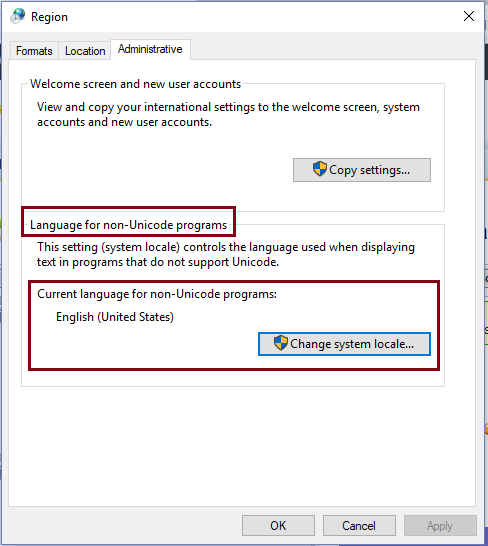
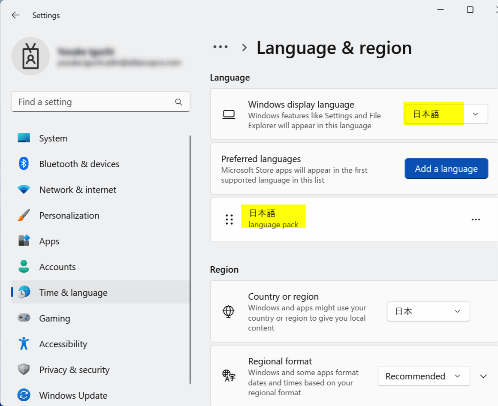

# How to Renew Japanese Visa Online with a Mac

This was one of the most annoying things I had to do in a while.
To be honest, I think going in person may be easier.

This is quick write-up of how I did it, in case it helps someone else.

## Preparations

### My Number card

Go to [My Number Card online application](https://www.kojinbango-card.go.jp/en-mynumber/) and apply for a My Number card if you don't have one. You need the physical card with a chip and photo, not just the paper one.

### Get a compatible IC Card Reader

Ask a friend or buy it from Amazon.

[Full List of IC card readers and writers compatible with My Number cards](https://www.jpki.go.jp/prepare/pdf/num_rwlist11.pdf)

> [!TIP]  
> If you have an android phone, you can use it as an IC card reader by installing the [JPKI利用者ソフト](https://play.google.com/store/apps/details?id=jp.go.jpki.mobile.utility&pcampaignid=web_share) app.

### Prepare Windows VM

I already tried using directly on Mac, but it did not work.

#### Install Parallels Desktop

Install [Parallels Desktop](https://www.parallels.com/products/desktop/trial/) to run a Windows virtual machine (VM) on your Mac.
* Every mac gets a 14-day free trial.
* If it expires, you either need to get a subscription or try your luck with the [UTM](https://alternativeto.net/software/utm/about/) or [VirtualBox](https://alternativeto.net/software/virtualbox/about/) as open source alternatives.

Prepare your Mac for Windows VM
* Make sure your Mac has enough disk space and RAM to run the VM.
* At least 30 GB of disk space and 8 GB of RAM is recommended.
* Windows VM will crash if you don't have enough disk space or RAM.

Install Windows 11 on Parallels Desktop.
* Make sure you have stable internet connection.
* Keep your mac plugged in & awake during the installation.

Windows 11 license key - not required; just use the trial version.

> [!CAUTION]  
> Make sure your mac has enough RAM (8+ GB) and disk space (30+GB) to run the VM!  

#### Change Language and Region settings to Japanese

1. Change the `Language for non-Unicode programs` to Japanese in the Windows settings.
    * Go to `Control Panel` > `Region` or `Region and Language` > `Administrative` tab.
    * Click on `Change system locale...` and select `Japanese (Japan)`.
    * Apply the changes and restart your computer.
    * 

2. Change the Language and Region settings to Japanese.
    * Go to `Settings` > `Time & Language` > `Language` > `Preferred languages`.
    * Click on `Add a language` and select `Japanese`.
    * Install the Japanese language pack.
    * Set it as the primary display language.
    * Apply the changes and restart your computer.
    * 

### Install JPKI app and Java on Windows VM

Once your Windows VM is ready, you need to install the following:
* [JPKI app (JPKI利用者ソフト)](https://www.jpki.go.jp/download/win.html)
* [latest JAVA update (Java8 Update 371)](https://www.java.com/en/download/)
  * Download directly, not via package manager.
  * "JRE" or "Java Runtime Environment" is just Java.
* [利用者クライアントソフト Edge/Chrome - Chrome ウェブストア](https://chromewebstore.google.com/detail/%E5%88%A9%E7%94%A8%E8%80%85%E3%82%AF%E3%83%A9%E3%82%A4%E3%82%A2%E3%83%B3%E3%83%88%E3%82%BD%E3%83%95%E3%83%88-edgechrome/ddhaancdmkmeigppopkakhpbboccibla?hl=ja)

Make sure to run the apps as administrator and allow them to run in the background.
* Right-click the app’s shortcut or executable and select "Run as administrator" from the context menu
* 

## Debugging

1. Restart your Windows VM if you encounter any issues.
1. Make sure your My Number card is fully inserted into the IC card reader.
1. Do not use Chrome's translation feature, as it may cause issues with the website.
1. If the Parallels Desktop VM does not install properly, just create a new VM and install Windows again.

## References

* [How to Renew Your Japan Visa Online and in Person Tokyo Cheapo | Tokyo Cheapo](https://tokyocheapo.com/living/renew-visa-online-japan/)
* [マイナンバーカードのご用意 | 公的個人認証サービス ポータルサイト](https://www.jpki.go.jp/prepare/juki.html)
