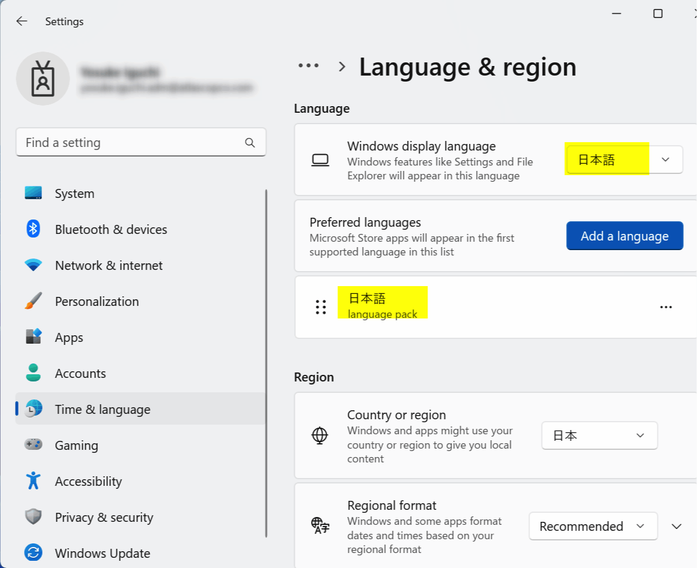
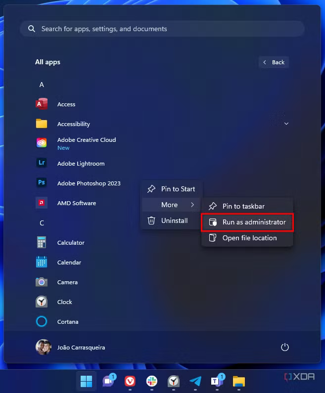

# How to Renew Japanese Visa Online with a Mac

This was one of the most annoying things I had to do in a while.
To be honest, I think going in person may be easier.

This is quick write-up of how I did it, in case it helps someone else.

> [!WARNING]  
> JPKI app does not work on macOS for Visa Renewal! Windows VM is required!

## Table of contents <!-- omit in toc -->

* [Preparations](#preparations)
  * [My Number card](#my-number-card)
  * [Get a compatible IC Card Reader](#get-a-compatible-ic-card-reader)
  * [Prepare Windows VM](#prepare-windows-vm)
    * [Option 1: Install Parallels Desktop](#option-1-install-parallels-desktop)
    * [Option 2: Install Windows 11 on UTM](#option-2-install-windows-11-on-utm)
    * [Optional: Setup Windows without a Microsoft Account](#optional-setup-windows-without-a-microsoft-account)
    * [Change Language and Region settings to Japanese](#change-language-and-region-settings-to-japanese)
  * [Install JPKI app and Java on Windows VM](#install-jpki-app-and-java-on-windows-vm)
* [Debugging](#debugging)
* [References](#references)

## Preparations

### My Number card

Go to [My Number Card online application](https://www.kojinbango-card.go.jp/en-mynumber/) and apply for a My Number card if you don't have one. You need the physical card with a chip and photo, not just the paper one.

### Get a compatible IC Card Reader

Ask a friend or buy it from Amazon.

[Full List of IC card readers and writers compatible with My Number cards](https://www.jpki.go.jp/prepare/pdf/num_rwlist11.pdf)

> [!TIP]  
> If you have an android phone, you can use it as an IC card reader by installing the [JPKI利用者ソフト](https://play.google.com/store/apps/details?id=jp.go.jpki.mobile.utility&pcampaignid=web_share) app.

### Prepare Windows VM

I already tried using directly on Mac, but the JPKI app did not work on a Mac.

Prepare your Mac for Windows VM
* Make sure your Mac has enough disk space and RAM to run the VM.
* At least 30 GB of disk space and 8 GB of RAM is recommended.
* Windows VM will crash if you don't have enough disk space or RAM.

> [!CAUTION]  
> Make sure your mac has enough RAM (8+ GB) and disk space (30+GB) to run the VM or it will crash!

#### Option 1: Install Parallels Desktop

Install [Parallels Desktop](https://www.parallels.com/products/desktop/trial/) to run a Windows virtual machine (VM) on your Mac.
* Every mac gets a 14-day free trial.
* If it expires, you either need to get a subscription ($100 or wait for the next day for a discount). Or try your luck with the [UTM](#option-2-install-windows-11-on-utm).

Install Windows 11 on Parallels Desktop.
* Make sure you have stable internet connection.
* Keep your mac plugged in & awake during the installation.

Windows 11 license key - not required; just use the trial version.

#### Option 2: Install Windows 11 on UTM

Install [UTM](https://mac.getutm.app/) to run a Windows virtual machine (VM) on your Mac.
* UTM is a free and open-source virtualization software.
* It is a bit more complicated to set up than Parallels Desktop, but I got it working so you can too.

Two options to download UTM on your Mac:
* [Download from the official website](https://mac.getutm.app/) - Completely free and open-source.
* [Download from the Mac App Store](https://apps.apple.com/app/utm-virtual-machines/id1538878817) - Costs $9.99, but supports the developers. Also I prefer having it in the App Store for easy updates.

Then follow the [official UTM documentation to install Windows 11](https://docs.getutm.app/guides/windows/).
The [How to Install Windows 11 on Mac (M1, M2, M3, M4)](https://www.youtube.com/watch?v=hdddzyIPasU) video is also helpful.

#### Optional: Setup Windows without a Microsoft Account

I did not want to use a Microsoft account, so I opened the command prompt and ran the following command to bypass the Microsoft account login during Windows setup:
* To open the command prompt, press `fn` + `SHIFT` + `F10` during the Windows setup.
* Run the following command in the command prompt: `start ms-cxh:localonly`

#### Change Language and Region settings to Japanese

1. Change the `Language for non-Unicode programs` to Japanese in the Windows settings.
    * Go to `Control Panel` > `Region` or `Region and Language` > `Administrative` tab.
    * Click on `Change system locale...` and select `Japanese (Japan)`.
    * Apply the changes and restart your computer.
    * 

2. Change the Language and Region settings to Japanese.
    * Go to `Settings` > `Time & Language` > `Language` > `Preferred languages`.
    * Click on `Add a language` and select `Japanese`.
    * Install the Japanese language pack.
    * Set it as the primary display language.
    * Apply the changes and restart your computer.
    * 

### Install JPKI app and Java on Windows VM

Once your Windows VM is ready, you need to install the following:
* [JPKI app (JPKI利用者ソフト)](https://www.jpki.go.jp/download/win.html)
* [latest JAVA update (Java8 Update 371)](https://www.java.com/en/download/)
  * Download directly, not via package manager.
  * "JRE" or "Java Runtime Environment" is just Java.
* [利用者クライアントソフト Edge/Chrome - Chrome ウェブストア](https://chromewebstore.google.com/detail/%E5%88%A9%E7%94%A8%E8%80%85%E3%82%AF%E3%83%A9%E3%82%A4%E3%82%A2%E3%83%B3%E3%83%88%E3%82%BD%E3%83%95%E3%83%88-edgechrome/ddhaancdmkmeigppopkakhpbboccibla?hl=ja)

Make sure to run the apps as administrator and allow them to run in the background.
* Right-click the app's shortcut or executable and select "Run as administrator" from the context menu
* 

## Debugging

Here are issues I encountered and how to fix them:
* Restart your Windows VM if you encounter any issues.
* If the Windows installation wizard does not start, restart your Windows VM and hit enter immediately after the VM starts.
* Make sure your My Number card is fully inserted into the IC card reader.
* Do not use Chrome's translation feature, as it may cause issues with the website.
* If the Parallels Desktop VM does not install properly, just create a new VM and install Windows again.

### Broken error message when running JPKI利用者ソフト

If you encounter any issues with the JPKI app, try the following:
* 
* Follow the instructions in [Change Language and Region settings to Japanese](#change-language-and-region-settings-to-japanese) section above.

## References

* [How to Renew Your Japan Visa Online and in Person Tokyo Cheapo | Tokyo Cheapo](https://tokyocheapo.com/living/renew-visa-online-japan/)
* [マイナンバーカードのご用意 | 公的個人認証サービス ポータルサイト](https://www.jpki.go.jp/prepare/juki.html)
