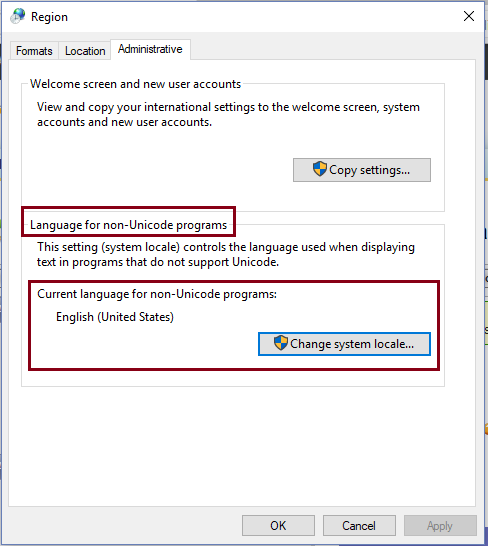
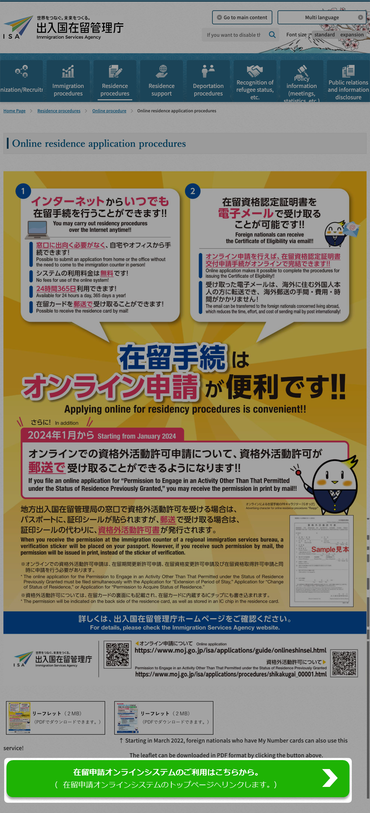

# How to Renew Japanese Visa Online with a Mac

This was one of the most annoying things I had to do in a while.
To be honest, I think going in person may be easier.

This is quick write-up of how I did it, in case it helps someone else.

> [!WARNING]  
> JPKI app does not work on macOS for Visa Renewal! Windows VM is required!

## Table of contents <!-- omit in toc -->

* [Preparations](#preparations)
  * [My Number card](#my-number-card)
  * [Get a compatible IC Card Reader](#get-a-compatible-ic-card-reader)
  * [Prepare Windows Virtual Machine (VM)](#prepare-windows-virtual-machine-vm)
    * [Method 1: UTM - Free and Open Source](#method-1-utm---free-and-open-source)
    * [Method 2: Parallels Desktop - Paid but Easier](#method-2-parallels-desktop---paid-but-easier)
    * [Windows 11 license key is not required](#windows-11-license-key-is-not-required)
    * [Optional: Setup Windows without a Microsoft Account](#optional-setup-windows-without-a-microsoft-account)
    * [Change Language and Region settings to Japanese](#change-language-and-region-settings-to-japanese)
  * [Watch this video tutorial](#watch-this-video-tutorial)
  * [Install JPKI app and Java on Windows](#install-jpki-app-and-java-on-windows)
    * [Verify JPKI app installation](#verify-jpki-app-installation)
  * [Online Visa Renewal](#online-visa-renewal)
* [Troubleshooting](#troubleshooting)
  * [Windows VM Issues](#windows-vm-issues)
  * [Broken error message when running JPKI利用者ソフト](#broken-error-message-when-running-jpki利用者ソフト)
  * [エラーコード：EW000J0200 Error from JPKI利用者ソフト](#エラーコードew000j0200-error-from-jpki利用者ソフト)
* [References](#references)

## Preparations

### My Number card

Go to [My Number Card online application](https://www.kojinbango-card.go.jp/en-mynumber/) and apply for a My Number card if you don't have one. You need the physical card with a chip and photo, not just the paper one.

### Get a compatible IC Card Reader

Ask a friend or buy it from Amazon.

[Full List of IC card readers and writers compatible with My Number cards](https://www.jpki.go.jp/prepare/pdf/num_rwlist11.pdf)

> [!TIP]  
> If you have an android phone, you can use it as an IC card reader by installing the [JPKI利用者ソフト](https://play.google.com/store/apps/details?id=jp.go.jpki.mobile.utility&pcampaignid=web_share) app.

### Prepare Windows Virtual Machine (VM)

I already tried using directly on Mac, but the JPKI app did not work on a Mac.

Prepare your Mac for Windows VM
* Make sure your Mac has enough disk space and RAM to run the VM.
* At least 30 GB of disk space and 8 GB of RAM is required.
* MacBook Pro is recommended, but MacBook Air can also work if you close all other apps and maybe run an external fan to keep it cool.
* Windows VM will crash if you don't have enough disk space or RAM.

UTM or Parallels Desktop?
* I tried both UTM and Parallels Desktop, and both worked.
* Parallels Desktop was slightly easier to set up but not worth the $100 fee.
* UTM is free and open-source. Only a bit more complicated to set up.
* UTM took me 3 hours to set up not knowing anything about it while Parallels Desktop took me 2 hours. Sadly, I do not get paid $100 per hour for my time. 😅

> [!CAUTION]  
> Make sure your mac has enough RAM (8+ GB) and disk space (30+GB) to run the VM or it will crash!

#### Method 1: UTM - Free and Open Source

What is UTM?
* UTM is a free and open-source virtualization software that allows you to run virtual machines (VM) on your Mac.
* It is based on QEMU and provides a user-friendly interface to create and manage VMs.\
* Watch this [YouTube video tutorial](https://www.youtube.com/watch?v=hdddzyIPasU) first and then it is pretty straightforward to set up.

Overview of the steps to install Windows 11 on UTM:
1. Install [UTM](https://mac.getutm.app/) to run a Windows virtual machine (VM) on your Mac.
    * Option 1: [Download from the official website](https://mac.getutm.app/) - Completely free and open-source.
    * Option 2: [Buy it on the Mac App Store](https://apps.apple.com/app/utm-virtual-machines/id1538878817) for $9.99 and support the developers.
    * App Store version is easier to update & manage but you can just download the free version from the [official Microsoft website](https://www.microsoft.com/software-download/windows11).
2. Download Windows 11 ISO file - Either using [CrystalFetch][] or directly from Microsoft.
    * I downloaded [CrystalFetch from the Mac App Store][crystalfetch-app-store] and then used it to download the latest Windows 11 ISO.
    * I downloaded the Windows 11 Home edition ISO file in English but later needed to change the language settings to Japanese.
3. Create a new VM in UTM and attach the Windows 11 ISO file.
    * Open UTM and click on the "+" button to create a new VM.
    * Select "Virtualize" and then "Windows".
    * Choose the downloaded Windows 11 ISO file as the boot disk.
    * Allocate at least 8 GB of RAM and 30 GB of disk space for the VM.
    * *8000 MiB is 8.39 GB*
    * Click "Create" to finish the VM setup.
4. Start the VM and follow the Windows installation wizard.
    * Make sure to hit the "Enter" key immediately after starting the VM to boot from the attached Windows ISO file.
    * Follow the on-screen instructions to install Windows 11.

Read the [official UTM documentation to install Windows 11](https://docs.getutm.app/guides/windows/) for detailed instructions.

[CrystalFetch]: https://github.com/TuringSoftware/CrystalFetch
[crystalfetch-app-store]: https://apps.apple.com/app/crystalfetch-iso-downloader/id6454431289

#### Method 2: Parallels Desktop - Paid but Easier

Install [Parallels Desktop](https://www.parallels.com/products/desktop/trial/) to run a Windows virtual machine (VM) on your Mac.
* Every mac gets a 14-day free trial.
* If it expires, you either need to get a subscription ($100 or wait for the next day for a discount).

Install Windows 11 on Parallels Desktop.
* Make sure you have stable internet connection.
* Keep your mac plugged in & awake during the installation.

#### Windows 11 license key is not required

For just this visa renewal, you do not need a Windows 11 license key. The trial version is sufficient.

#### Optional: Setup Windows without a Microsoft Account

I did not want to use a Microsoft account, so I opened the command prompt and ran the following command to bypass the Microsoft account login during Windows setup:
* To open the command prompt, press `fn` + `SHIFT` + `F10` during the Windows setup.
* Run the following command in the command prompt: `start ms-cxh:localonly`

#### Change Language and Region settings to Japanese

As you can image, this is Japanese government made software - not only do you need to run it on Windows, but you also need to change the language and region settings to Japanese for it to work properly.

For those who already have a Windows computer, you can start from here. ✍️

1. Change the `Language for non-Unicode programs` to Japanese in the Windows settings.
    * Go to `Control Panel` > `Region` or `Region and Language` > `Administrative` tab.
    * Click on `Change system locale...` and select `Japanese (Japan)`.
    * Apply the changes and restart your computer.
    * 

2. Change the Language and Region settings to Japanese.
    * Go to `Settings` > `Time & Language` > `Language` > `Preferred languages`.
    * Click on `Add a language` and select `Japanese`.
    * Install the Japanese language pack.
    * Set it as the primary display language.
    * Apply the changes and restart your computer.
    * 

### Watch this video tutorial

Before continuing, I highly recommend watching this video tutorial that shows how to set up the JPKI app on Windows for visa renewal:
[日本在留資格オンライン申請（在留資格线上申請） - YouTube](https://www.youtube.com/watch?v=IWJOFH99NpM)

Yes it is in Chinese but OMG it is the best walkthrough I have found so far.
After watching this video BEFOREHAND, follow the steps below to install and use the JPKI app.

### Install JPKI app and Java on Windows

Once the Windows is configured correctly (JA language setting), you need to install the following:
* [JPKI app (JPKI利用者ソフト)](https://www.jpki.go.jp/download/win.html)
* [latest JAVA update (Java8 Update 371)](https://www.java.com/en/download/)
  * Download directly, not via package manager.
  * "JRE" or "Java Runtime Environment" is just Java.
* [利用者クライアントソフト Edge/Chrome - Chrome ウェブストア](https://chromewebstore.google.com/detail/%E5%88%A9%E7%94%A8%E8%80%85%E3%82%AF%E3%83%A9%E3%82%A4%E3%82%A2%E3%83%B3%E3%83%88%E3%82%BD%E3%83%95%E3%83%88-edgechrome/ddhaancdmkmeigppopkakhpbboccibla?hl=ja)

Make sure to run the apps as administrator and allow them to run in the background.
* Right-click the app's shortcut or executable and select "Run as administrator" from the context menu
* 

> [!WARNING]  
> Yes, order matters & yes, you need to install Java - this is a Japanese government made software, so it is not straightforward. 😅

#### Verify JPKI app installation

Open the JPKI app (`JPKI利用者ソフト`) and make sure it runs without any errors.

> [!TIP]
> Friendly reminder to save, take a snapshot of the VM, and restart the VM after installing the JPKI app and Java.

### Online Visa Renewal

After installing the JPKI app and Java, you can now proceed to the online visa renewal process.

1. Open the Immigration Services Agency's website for online visa renewal in Japan - [Online Residence Application Procedures](https://www.moj.go.jp/isa/applications/online/onlineshinsei.html?hl=en).
    * `https://www.moj.go.jp/isa/applications/online/onlineshinsei.html`
1. Click on the big green button labeled `在留申請オンラインシステムのご利用はこちらから。（在留申請オンラインシステムのトップページへリンクします。）`
    * `https://www.ras-immi.moj.go.jp/WC01/WCAAS010/`
    * 

## Troubleshooting

Here are some issues I encountered while trying to setup the Windows VM, install and use the JPKI app, and how to fix them:

### Windows VM Issues

* Issue: When starting the Windows VM for the first time and it shows a black terminal screen titled `UEFI Iterative Shell v2.2` instead of the Windows installation wizard.
  * Cause: You have not booted the Windows with the attached Windows Boot ISO image file correctly. You were too slow to hit the enter key.
  * Solution: Restart your Windows VM and hit enter immediately after the VM starts. This triggers the VM to boot from the attached Windows ISO file thus starting the Windows installation wizard.
  * 

* Issue: The Windows VM crashes or freezes during the installation.
  * Cause: Not enough disk space or RAM allocated to the VM. Or your Mac is low on resources.
  * Solution: Make sure your Mac has at least 30 GB of free disk space and 8 GB of RAM available. Adjust the VM settings accordingly.

### Broken error message when running JPKI利用者ソフト

When trying to run the JPKI installer, you may encounter a broken error message like this:
* 

Cause: JPKI app uses non-Unicode characters and the Windows's `Language for non-Unicode programs` is not set to Japanese. (Like even Japanese people may not have configured this setting...)

Solution: Follow the instructions in [Change Language and Region settings to Japanese](#change-language-and-region-settings-to-japanese) section above.

### エラーコード：EW000J0200 Error from JPKI利用者ソフト

You may get the following error when running the JPKI利用者ソフト:
* 
* 利用者クライアントソフトエラー
* エラーコード：EW000J0200

Possible causes:
* The MyNumber Card reader is not connected to your Windows VM - either by not connecting to your Mac or not passing the USB device to the VM.
* The MyNumber Card is not inserted properly into the IC card reader.
* The JPKI app is not installed correctly or not running as administrator.

Solution:
* Ensure that your MyNumber Card is inserted properly into the IC card reader. (Chip contacting the reader)
* Ensure that the IC card reader is connected to your Mac - unplug & replug it.
* Ensure that the IC card reader is passed through to the Windows VM - restart the UTM or Parallels Desktop apps and check the VM settings.
* Ensure that the JPKI app is installed correctly and running as administrator.

## References

* [How to Renew Your Japan Visa Online and in Person Tokyo Cheapo | Tokyo Cheapo](https://tokyocheapo.com/living/renew-visa-online-japan/)
* [マイナンバーカードのご用意 | 公的個人認証サービス ポータルサイト](https://www.jpki.go.jp/prepare/juki.html)
