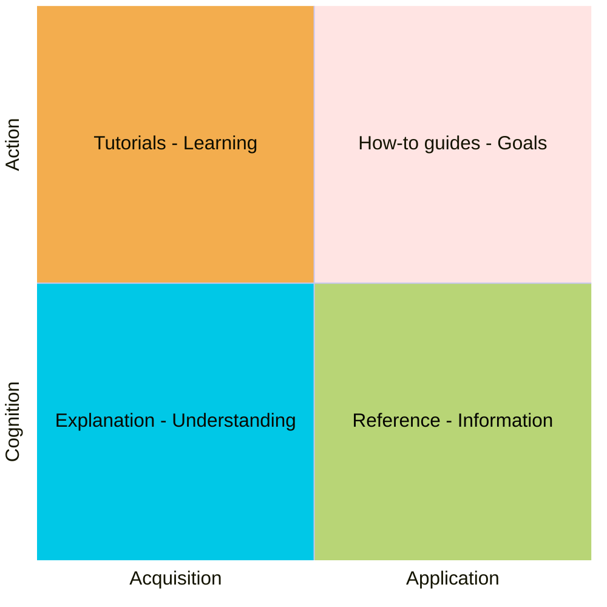

# Help documentation overview

This guide outlines the different types of help documents and what each type aims to achieve.

## Change log <!-- omit in toc -->

* 2025-03-25 - Initial draft

## Table of contents <!-- omit in toc -->

* [Help document types](#help-document-types)
* [Comparing help document types](#comparing-help-document-types)
* [How-to guides](#how-to-guides)
* [Reference document](#reference-document)
* [References](#references)

## Help document types

Here is a quick overview of the types of help documents:

| Type                   | Goal               | Description                                  | Example                                                       |
| ---------------------- | ------------------ | -------------------------------------------- | ------------------------------------------------------------- |
| [Tutorials][]          | Gain a skill       | Teach a concept with a lesson                | Beginner's guide to user management                           |
| [How-to guides][]      | Complete a task    | Step-by-step instructions to solve a problem | Microsoft Entra ID as a IdP for identity provider setup guide |
| [Reference document][] | Required details   | Detailed information about the product       | API doc for Create User API                                   |
| [Explanation][]        | Understand a topic | Provide context and understanding            | How IAM works in the admin portal                             |

## Comparing help document types

Tutorial vs. How-to Guide:

* Tutorials should provide a level higher than How-to Guides.
* How-to Guides addresses the specific steps to complete a task.

Tutorial vs. Explanation:

* Readers will gain a skill from a tutorial. Example: How to create a secure user account.
* Readers will understand a topic from an explanation. Example: How HTTPS encryption works.

## How-to guides

* How-to guides are **directions** that guide the reader through a problem or towards a result. How-to guides are **goal-oriented**.
* [How-to guides structure and template](./templates/how-to-guides-template-structure.md)

## Reference document

* Reference documents are **technical descriptions** of the software and how to operate it. Reference document is **information-oriented**.
* [Reference document structure and template](./templates/reference-document-template-structure.md)

## References

[Diataxis](https://diataxis.fr/) - Handbook for organizing and writing documentation

* The core idea of Diataxis is that there are fundamentally four identifiable kinds of documentation, that respond to four different needs. The four kinds are: tutorials, how-to guides, reference and explanation. Each has a different purpose, and needs to be written in a different way.

[Tutorials]: https://diataxis.fr/tutorials/
[How-to guides]: https://diataxis.fr/how-to-guides/
[Reference document]: https://diataxis.fr/reference/
[Explanation]: https://diataxis.fr/explanation/
