## {{$frontmatter.title}}

```mermaid
xychart-beta
  title "Travel time from Tokyo (minutes)"
  x-axis ["Nozomi","Hikari","Kodama"]
  y-axis "Minutes" 0 --> 250
  bar "Kyoto" [132,160,219]
  bar "Shin-Osaka" [147,174,234]
```

### Tokyo to Kyoto/Osaka Shinkansen

* Get the window-side seat E (or seat D in Green Cars) for the best chance to see Mt. Fuji.

### Osaka/Kyoto to Tokyo Shinkansen

* Get the

* Get the left side (D or E) seats for the best chance to see Mt. Fuji

near Mishima/Shin-Fuji on a clear day.

Mount Fuji can be seen from the Tokaido Shinkansen between Tokyo and Osaka. When coming from Tokyo, the mountain appears on the right side of the train and is best viewed around Shin-Fuji Station, about 40-45 minutes into the journey. The best views can be enjoyed from the window-side seat E (or seat D in Green Cars).

---

Best seat Osaka → Tokyo (Tokaido Shinkansen)

If you want the Mt. Fuji view 🗻
• Sit on the left-hand side of the train.
• Ordinary car (3+2): choose A (window), or B/C if you are fine without the window.
• Green car (2+2): choose A (window) (left side).
A common landmark is around Shin-Fuji / Shizuoka area, where the view window is typically best on clear days. 

If you want a power outlet 🔌
• On N700S sets, outlets are available broadly, but provisioning can vary by service/set; on many configurations, window seats and front/rear rows are the safest pick in Ordinary, and all Green seats have outlets. 
• Practical rule: book A (window) for Fuji and maximize the chance of an outlet.

If you have oversized luggage 🧳
• If your bag's total dimensions (A+B+C) are over 160 cm, reserve a seat with an oversized baggage area/compartment (often the last row in a car). 

If you want it quietest
• Choose a reserved seat in a middle car, away from end doors and bathrooms (less foot traffic).

Default recommendation: Ordinary car, seat A (window) on the left side (Osaka → Tokyo) 🗻🔌

## Copy-ready (full)

Traveling from Tokyo toward Kyoto or Osaka on the Tokaido Shinkansen, Mt. Fuji is usually visible on the **right side** of the train around the Mishima and Shin-Fuji area (if the weather is clear). If you can reserve seats, choose **D or E** for the best chance of seeing it.

## Copy-ready (short)

`Tokyo -> Kyoto/Osaka Shinkansen tip: reserve right-side seats (D/E) for the best chance to see Mt. Fuji near Mishima/Shin-Fuji on a clear day.`

## Optional add-on line

This is one of the best highlights of the Tokyo to Kyoto train ride, so it is worth planning seats in advance.
